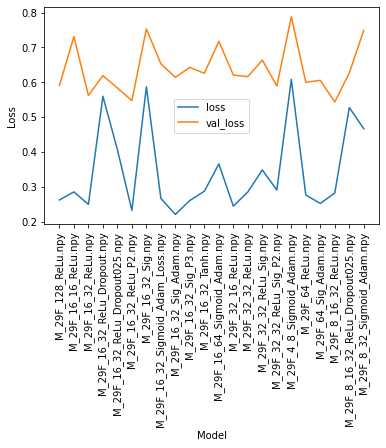
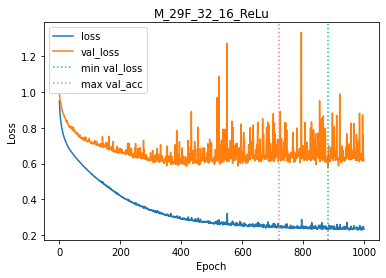

# Assignment 5: Neural Networks
### Micaela Camila Patiño Hermosa
### Kevin Céspedes Arancibia
 
In order to construct a model to predict the adaptability of a student in online classes. The needed steps were:

## Recognize the kind of problem: <b>Classification</b> 
The waited output is a categorical variable that represents the adaptability level ("Alto", "Moderado", "Bajo") for that reason the model classify each sample in one of that categories.

## Prepare the dataset
In relation to the previously defined categorical variables. Certain input and output variables were transformed to an appropriate representation (One hot encoding). 
(This was realized and documented on `data_preparation.ipynb` file)

## Test different hypothesis and neural networks architectures
We test approximately 20 different hypothesis, neural networks architectures, activation functions. 
(This was realized and documented on `neural_network_test.ipynb` file) 
Note: To keep an organized code the definition of the Neural Network models and its variations were in `neural_network.py` file. 
After train the models and observe the performance of each architecture at the training time. We consider analyze the best result of each architecture. Analyzing the min val_loss (test_error). 
(This was realized and documented on `best_model_search.ipynb` file) 
 
Based on this we could select our best models

## Conclusions
 
`Epoch 882 min val loss - val_loss:0.58 - val_acc:0.83 - loss:0.24 - acc:0.89` 

The model with the best global results was M29F_32_16_ReLu. The complexity of the model was enough balanced to get a good generalization for all the data. 
The other models got good results but some presents certain overfit to train data. And another fit very well to the validation data but didn't get the same performance with the trainig data.